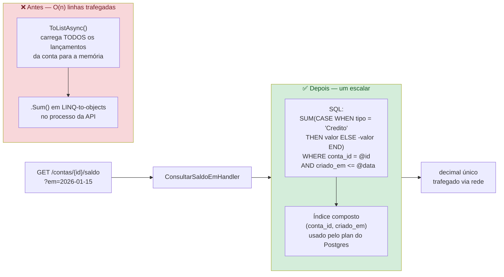

# ADR-016 — Saldo histórico via agregação SQL

**Status:** Aceito
**Data:** 2026-09-23

## Fluxo da consulta: antes vs depois



## Contexto

`ConsultarSaldoEmAsync` trazia todos os lançamentos até a data de referência para a
memória (`ToListAsync`) e somava com LINQ-to-objects. Para o cenário de performance
do desafio, isso degrada linearmente com o volume: o tráfego de rede e o uso de
memória crescem com o número de lançamentos.

## Decisão

Empurrar a agregação para o banco. A consulta soma o sinal do lançamento
diretamente em SQL, traduzida pelo Npgsql:

```
SUM(CASE WHEN tipo = 'Credito' THEN valor ELSE -valor END)
WHERE conta_id = @id AND criado_em <= @data
```

No LINQ o `CASE` é expresso via ternário dentro do `Sum` (respeitando a convenção
"sem `else`" do projeto). O índice composto `(conta_id, criado_em)` já existente
suporta o filtro.

## Alternativas consideradas

- **Manter soma em memória** — simples, mas O(n) trafegado; inadequado ao tema de
  performance.
- **Snapshot periódico de saldo histórico** — resolveria com O(1) para qualquer
  data, mas exige job agendado e tabela de checkpoints. Documentado como evolução;
  fora do escopo atual.

## Consequências

- Consulta de saldo histórico passa a trafegar um único escalar, não a lista.
- Aproveita o índice existente.
- Custo: depende da tradução LINQ→SQL do Npgsql; fallback documentado caso a
  tradução do ternário falhe (materializar só a coluna `valor` + `tipo`).
