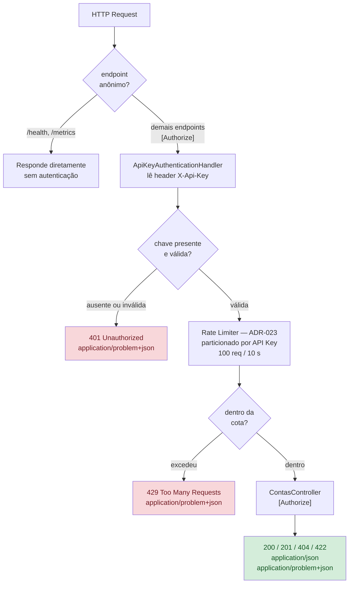

# ADR-018 — API Key (vs JWT)

**Status:** Aceito
**Data:** 2026-09-23
**Relacionado:** ADR-021

## Fluxo do pipeline de autenticação e controle de acesso

## Contexto

O desafio cobra explicitamente *"como proteger dados sensíveis dos clientes"*.
Os endpoints estavam totalmente abertos — inaceitável para um sistema financeiro.
É preciso um mecanismo de autenticação proporcional ao escopo.

## Decisão

Autenticação por **API Key**: um `AuthenticationHandler` customizado lê o header
`X-Api-Key` e valida contra chaves configuradas. `[Authorize]` no `ContasController`;
`/saude` e Swagger ficam `[AllowAnonymous]`. Falha de auth retorna `401` em
ProblemDetails.

## Alternativas consideradas

- **JWT completo** — mais robusto e realista para identidade de cliente (claims,
  emissão/validação de token, ownership por `ClienteId`), mas exige um endpoint de
  auth e gestão de tokens que foge do domínio central (movimentações). Muito código
  para o valor demonstrado no escopo.
- **Sem auth (só hardening)** — deixaria os endpoints abertos; contraria o critério
  explícito do PDF.

## Consequências

- Autenticação serviço-a-serviço pragmática e stateless.
- Não há identidade de cliente nem autorização por ownership — documentado como
  evolução (JWT + validação de `ClienteId`).
- Simples de testar (header presente/ausente/ inválido → 200/401).
- As chaves ficam em configuração, não em banco (ver ADR-021).
