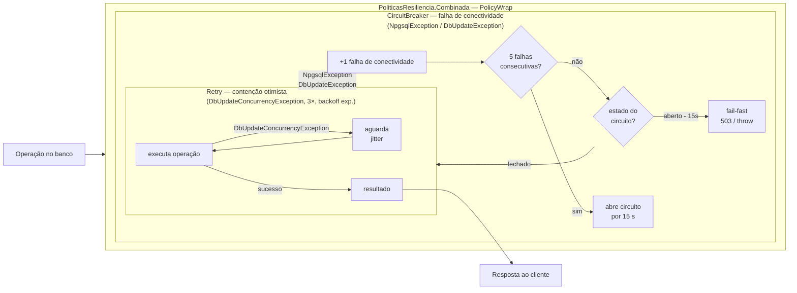

# ADR-024 — Circuit breaker separado do retry (PolicyWrap)

**Status:** Aceito
**Data:** 2026-09-23
**Relacionado:** ADR-005

## Fluxo da PolicyWrap



> **Regra de ouro:** o Retry trata falhas **transitórias esperadas** (conflito de concorrência).
> O CircuitBreaker trata **indisponibilidade de infraestrutura**. Misturar os dois semânticos
> em um único policy é um antipadrão — o retry exaure contra um banco fora do ar.

## Contexto

O desafio pede tratar *"indisponibilidade parcial / falhas parciais"*. O Polly já
está no projeto para retry de concorrência (ADR-005), que trata
`DbUpdateConcurrencyException` — uma falha *esperada e transitória* resolvida por
retentativa. Falha de *conectividade do banco* é um problema diferente: retentar
contra um banco fora do ar só piora a situação.

## Decisão

Adicionar um `CircuitBreakerPolicy` (Polly) com alvo distinto do retry: proteger
contra indisponibilidade do banco (`DbUpdateException`/`NpgsqlException`/timeout).
Combinar via `PolicyWrap`: o retry de concorrência (interno) é envolto pelo circuit
breaker de infra (externo).

```
CircuitBreaker(infra)  →  Retry(concorrência)  →  operação
```

## Alternativas consideradas

- **Um só policy misturando os dois** — erro comum: aplicar retry a falha de
  conectividade amplia a carga sobre um banco já degradado, e abrir o circuito em
  conflito de concorrência (que é normal sob carga) rejeitaria requisições válidas.
- **Sem circuit breaker** — aceitável no escopo mínimo, mas deixa o critério de
  "indisponibilidade parcial" sem resposta técnica.

## Consequências

- Falha de concorrência → retentada (transitória por natureza).
- Falha de conectividade → circuito abre, falha rápido, dá tempo ao banco recuperar.
- Separação explícita evita o antipadrão de misturar as duas semânticas.
- Estado do circuito pode alimentar métricas/health (evolução).
