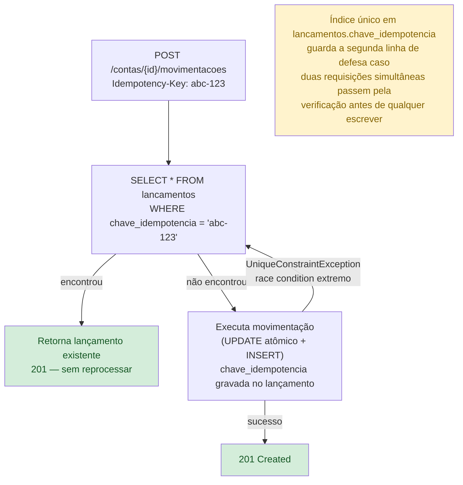

# ADR-028 — Idempotência sem TTL (com trilha de evolução)

**Status:** Aceito
**Data:** 2026-09-23

## Fluxo de idempotência

> Sem TTL: a chave vive indefinidamente no ledger junto do lançamento.
> Custo aceito no volume atual; tabela dedicada com expiração é a evolução documentada.

## Contexto

A idempotência é garantida pela chave `Idempotency-Key` → `Lancamento.ChaveIdempotencia`,
com índice único no banco. Não há expiração (TTL) nem storage dedicado para o estado
de idempotência — a chave vive para sempre junto do lançamento.

## Decisão

Manter a idempotência baseada na chave única em `lancamentos`, **sem TTL e sem
storage dedicado**, no escopo atual. Documentar explicitamente o estado e a trilha
de evolução.

## Alternativas consideradas

- **Tabela dedicada de idempotência com TTL** — separa o estado de idempotência do
  ledger, permite expiração e limpeza. Mais robusto sob altíssimo volume, mas
  adiciona complexidade desproporcional ao escopo.
- **Redis com TTL** — rápido e com expiração nativa, mas adiciona dependência de
  infra externa.

## Consequências

- Solução simples e correta: chave única no banco impede duplicação, verificada
  antes de qualquer escrita.
- A tabela `lancamentos` acumula chaves indefinidamente (sem limpeza) — aceitável no
  volume do escopo.
- Evolução clara documentada: tabela dedicada com TTL ou Redis quando o volume
  justificar.
